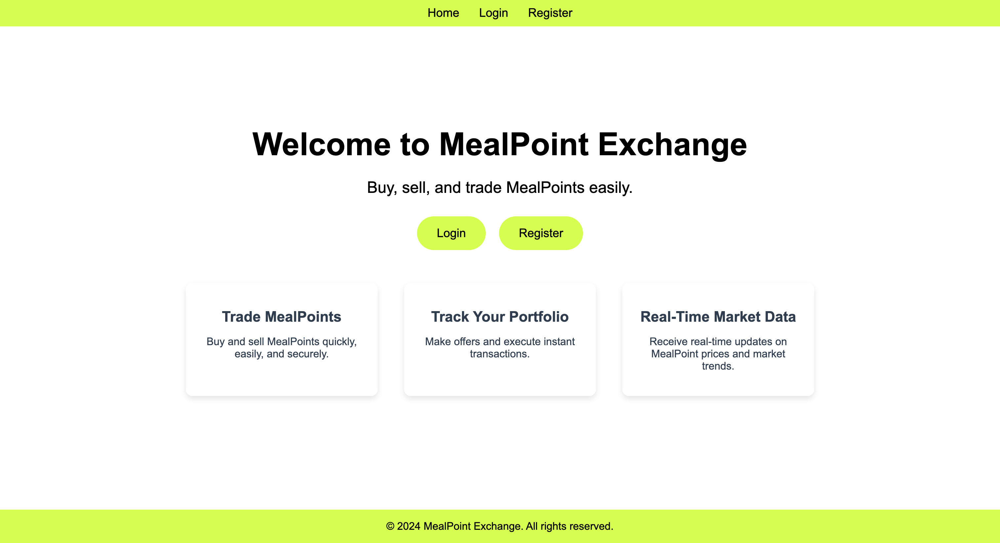

# MealPoints Stock Exchange

This project is a market platform where users can interact, place buy and sell orders, negotiate directly through messages, and track market trends in real time. It incorporates modern web technologies and provides an interactive, dynamic environment for trading.

### Languages and Frameworks Used
The project was built using the following technologies:

- **React**: The frontend of the platform is built with React to create a dynamic and responsive user interface.
- **Express (Node.js)**: The backend of the platform uses Express, a Node.js framework, to manage server-side logic and route handling.
- **MongoDB**: The database is MongoDB, used to store user data, orders, transactions, and other platform-related information.

### Core Features
The platform provides several key features for users:

- **User Authentication**: Users can register, log in, and log out securely. The authentication process ensures that users are authenticated before placing any orders or engaging in messaging.
- **Order Management**: Logged-in users can place buy and sell orders. When a match is found between a buy and sell order, the orders are executed automatically.
- **Direct Messaging (DM)**: Users can send direct messages to each other to negotiate terms, discuss prices, or make private offers.
- **Market Data**: Users can view real-time market data, including trends in meal points prices and a history of previous transactions.

### Best Practices
To ensure code quality and consistency, the project follows best practices:

- **Code Formatting**: The code is well-formatted and adheres to established conventions for readability and maintainability.
- **HTML Validation**: The HTML output passes the W3C validator to ensure it is semantically correct and meets accessibility standards.

### Creative Features
This project includes creative elements that enhance the user experience:

- **Real-Time Updates with Socket.IO**: Socket.IO was integrated into both the frontend and backend, enabling live updates for order matches, new bids, current market trends, and private messages. The real-time functionality ensures that users receive instant notifications about changes and actions on the platform.
- **Private Offer System**: Users can make private offers on specific bids or asks. Offers are stored in the MongoDB offers collection and can be marked with statuses such as "pending," "accepted," or "denied." Recipients can view these offers and manage them through the "My Offers" page, where they can accept or reject them. When an offer is accepted, the transaction is processed automatically, updating meal points and account balances for both users.

### Conclusion
This project demonstrates the integration of multiple technologies to create an interactive and functional platform. By combining React, Express, and MongoDB with real-time communication and private offer features, the platform offers an engaging experience for users looking to interact and trade.
